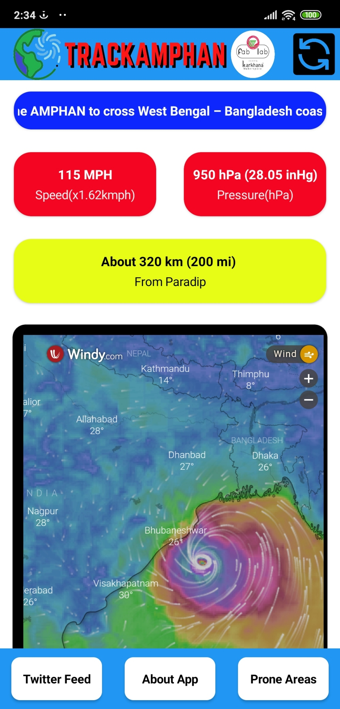

# ⛈ TrackAmphan ⛈ `v1.2`

An Android based web-app which gives live information about the Severe Cyclonic Storm ‘AMPHAN’.

#### Updates
- Check releases to download the latest version of app.
- Latest App Release
-- The app with v1.2 is released; Dtd: `20/05/2020`

## About App

- Live cyclone map giving information about the eye of the cyclone, speed variations, and direction. (Thanks to windy.com for the live map)
- Live update on the areas which are prone to get affected by Amphan. (Thanks to maps.google.com and IMD)
- Live Twitter feed of IMD giving every detail of Amphan and it's news.

## Features

- Supports in every Android Device. 📱
- Live Updates on cyclone by IMD.🌪
- Live Map 🗺️ 
- Twitter Feed. 📟 
- Lite and consumes less space. 🚀
- Eyecatching UI. 📲
#### What's New
-- Live Speed 🌫
-- Live Pressure 🌀
-- Live Location Status 📍

### Screenshots
- What's New
 

--

    

#### Layout Details

## Support developers 🌟
- Give this repo a **STAR** 🌟 to encourage the developer to make more projects like this.

       

`This project is made under SOA FAB LAB of Siksha 'O' Anusandhan University.`
